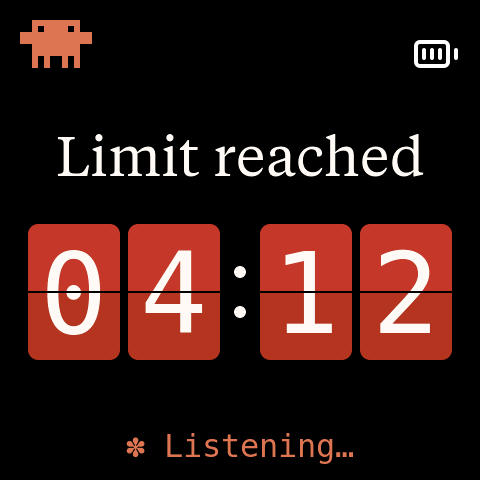
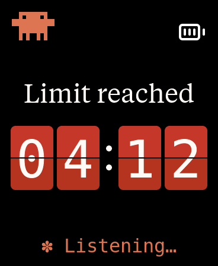

# Clawdmeter

A desk-side Claude Code usage monitor built on a small ESP32 AMOLED board. It shows your 5-hour session and weekly usage, plays Anthropic's official Clawd animations and switches to a red split-flap countdown when you hit your usage limit. Two side buttons double as a Bluetooth keyboard for Claude Code's voice mode and mode toggle.

This is a fork of [HermannBjorgvin/Clawdmeter](https://github.com/HermannBjorgvin/Clawdmeter). See [What's new in this fork](#whats-new-in-this-fork) for what changed.

|              Usage meter              |              Clawd animation screen              |
| :-----------------------------------: | :----------------------------------------------: |
|  |  |

## Contents

- [What's new in this fork](#whats-new-in-this-fork)
- [Screens](#screens)
- [Hardware](#hardware)
- [Installation](#installation): [macOS](#macos) | [Linux](#linux) | [Windows](#windows)
- [Physical buttons](#physical-buttons)
- [Testing the Limit reached screen](#testing-the-limit-reached-screen)
- [How it works](#how-it-works)
- [BLE protocol](#ble-protocol)
- [Development](#development)
- [Credits](#credits) and [licensing warning](#licensing-gray-area-warning)

## What's new in this fork

### Limit reached screen

When your 5-hour session reaches 100%, the usage view changes to a "Limit reached" headline over an HH:MM countdown to the reset, shown on red split-flap cards.

| AMOLED-2.16 (480×480) | AMOLED-1.8 (368×448) |
| :---: | :---: |
|  |  |

- The countdown steps down every minute. Only the cards whose digit changes flip.
- Each usage update from your computer (about once a minute) corrects the countdown.
- At 00:00 the cards hold until the window resets and the usage panels return.
- The "Usage" title is hidden on this screen, so "Limit reached" is the only heading.

Upstream showed the "No data" idle screen in this situation. When you hit the limit, the API answers with HTTP 429, and the daemon threw that response away. The Windows daemon in this fork reads the usage headers from 429 responses too, so the board learns that you are at 100%. The Linux daemon already read the headers from every response.

> **Known limitation (macOS):** the macOS daemon still discards 429 responses, so on macOS the board shows "No data" instead of the limit screen when you hit your limit.

You don't need to use up your quota to see the screen. The firmware has a [`fakelimit` test command](#testing-the-limit-reached-screen).

### Other changes

- **Early fixes** to get the project running on my own laptop.
- **Windows daemon:** no longer crashes when the Bluetooth radio is off or missing.
- **Ported from upstream:** this fork started as a point-in-time copy and fell about 90 commits behind. These upstream improvements were brought over:
  - A fix for frequent Bluetooth disconnects on Windows.
  - A single-owner pairing lock, so other nearby computers can't send data to your board.
  - Windows reconnect to a board that is already paired (a paired board stops advertising, so a plain scan can't find it).
  - Automatic restart of the Windows tray daemon after a crash.
  - Anthropic's official Clawd animations on a new 60×60 animation engine, plus an animated corner mascot on the usage screen.
- **Desktop simulator:** runs the real firmware UI in a window on Linux or macOS. See [`SIM-USAGE.md`](SIM-USAGE.md).
- **CI:** every push and pull request builds all boards plus the simulator and runs the daemon tests.
- **Serial commands:** `fakelimit` and `help`. The board echoes each command it receives.

## Screens

The board starts on the splash. Tap the screen to switch to the usage view, and tap again to go back.

| Splash | Usage | Limit reached |
| :---: | :---: | :---: |
|  |  |  |

The usage view shows one of four states:

| State | When | What you see |
|---|---|---|
| **Usage** | Fresh data from your computer | Session and weekly bars with reset times. Bars turn amber at 50% and red at 80%. |
| **Limit reached** | Session at 100% | The split-flap countdown to the reset |
| **No data** | Connected, but no update for 90 seconds | A sleeping Clawd and "Listening… / No data…" |
| **Pairing hint** | Not connected to your computer | How to pair: hold the power button for 3 seconds, then release |

**Status line:** the bottom line shows the connection state, or a rotating Claude Code-style word such as "Baking…" when all is well.

**Splash animations:** these get busier as your usage rate climbs. The firmware tracks how fast your session % rises and picks animations from four mood groups (idle, normal, active, heavy). It changes animation every 20 seconds within the current group.

**Corner mascot:** on the S3 boards a small animated Clawd lives in the corner of the usage view. The C6 shows a still image because it has no PSRAM.

**Auto-sleep:** after 30 minutes without a touch or button press, the screen fades to black. By default it stays on while USB power is connected. The first touch or press after sleep only wakes the screen. You can change these settings in `firmware/src/idle_cfg.h`.

## Hardware

| Board | Build env | Screen | Buttons |
|---|---|---|---|
| [Waveshare ESP32-S3-Touch-AMOLED-2.16](https://www.waveshare.com/esp32-s3-touch-amoled-2.16.htm?&aff_id=149786) | `waveshare_amoled_216` | 480×480 | 3 |
| [Waveshare ESP32-C6-Touch-AMOLED-2.16](https://www.waveshare.com/esp32-c6-touch-amoled-2.16.htm?&aff_id=149786) | `waveshare_amoled_216_c6` | 480×480 | 3 |
| [Waveshare ESP32-S3-Touch-AMOLED-1.8](https://www.waveshare.com/esp32-s3-touch-amoled-1.8.htm?&aff_id=149786) | `waveshare_amoled_18` | 368×448 | 2 |

- **AMOLED-1.8:** two panel revisions ship under this name. The firmware detects which one you have at boot, so one build drives both.
- **C6:** has no PSRAM, so it gets a still corner mascot and doesn't support the `screenshot` command.

**Porting to another board:** each board lives in its own folder under `firmware/src/boards/` behind a small hardware layer. Add a folder and a PlatformIO env; the shared UI code doesn't change. See [`docs/porting/adding-a-board.md`](docs/porting/adding-a-board.md) and [`docs/porting/hal-contract.md`](docs/porting/hal-contract.md).

## Installation

You need:

- [PlatformIO CLI](https://docs.platformio.org/en/latest/core/installation/index.html) to build and flash the firmware
- Claude Code with an active subscription, logged in with `claude login`
- **Linux:** `curl`, `bluetoothctl` and `busctl` (BlueZ)
- **macOS:** `python3` (the installer sets up a venv with `bleak` and `httpx`)
- **Windows 10/11:** Python 3.11+ (the installer sets up a venv with `bleak`, `httpx`, `pystray` and `Pillow`)

Each setup has three steps: flash the firmware, pair the board over Bluetooth, then install the daemon that sends your usage to the board.

To list the board env names, look at the `[env:...]` lines in `firmware/platformio.ini`. The `flash.sh` and `flash-mac.sh` scripts print them when you run them with no arguments.

### macOS

The macOS daemon, LaunchAgent and flash helper were ported by [Chris Davidson (@lorddavidson)](https://github.com/lorddavidson). Thanks, Chris!

**1. Flash the firmware**

```bash
./flash-mac.sh waveshare_amoled_216                       # auto-detects /dev/cu.usbmodem*
./flash-mac.sh waveshare_amoled_18  /dev/cu.usbmodem1101  # or give the USB serial port
```

**2. Pair the board:** open **System Settings → Bluetooth** and click *Connect* next to "Clawdmeter".

**3. Install the daemon.** It reads your Claude OAuth token from the macOS Keychain (service `Claude Code-credentials`), checks your usage every 60 seconds and sends it to the board.

```bash
./install-mac.sh
```

The installer creates a venv in `daemon/.venv/`, installs a LaunchAgent at `~/Library/LaunchAgents/com.user.claude-usage-daemon.plist` and loads it. The first run is interactive so macOS can ask for Bluetooth permission.

```bash
launchctl list | grep claude-usage                                          # check it's running
tail -F ~/Library/Logs/claude-usage-daemon.out.log                          # live logs
launchctl unload ~/Library/LaunchAgents/com.user.claude-usage-daemon.plist  # stop
launchctl load -w ~/Library/LaunchAgents/com.user.claude-usage-daemon.plist # start
```

### Linux

**1. Flash the firmware**

```bash
./flash.sh waveshare_amoled_216                  # uses /dev/ttyACM0
./flash.sh waveshare_amoled_18  /dev/ttyACM1     # or give the USB serial port
```

**2. Pair the board.** It advertises as "Clawdmeter":

```bash
bluetoothctl scan le
# When "Clawdmeter" appears:
bluetoothctl pair F4:12:FA:C0:8F:E5    # use your board's MAC
bluetoothctl trust F4:12:FA:C0:8F:E5
```

**3. Install the daemon.** It checks your usage every 60 seconds and sends it to the board.

```bash
./install.sh
systemctl --user start claude-usage-daemon
systemctl --user status claude-usage-daemon         # check status
journalctl --user -u claude-usage-daemon -f         # live logs
```

### Windows

Runs natively on Windows; WSL is not supported. A tray app sends your usage to the board and starts at login.

Before you start:

- Install **Python 3.11+** from [python.org](https://www.python.org/downloads/) and check *"Add python.exe to PATH"*.
- Run `claude login`. The daemon reads the token from `%USERPROFILE%\.claude\.credentials.json`, then `%LOCALAPPDATA%\Claude\`, then `%APPDATA%\Claude\`.
- Keep the repo on a **native Windows path** such as `C:\ClaudeProjects\ClawdMeter`. The installer refuses a `\\wsl$` path.

**1. Flash the firmware.** Use your board's COM port from Device Manager or `pio device list`:

```powershell
pio run -d firmware -e waveshare_amoled_216 -t upload --upload-port COM3
```

**2. Pair the board:** **Settings → Bluetooth & devices → Add device → Bluetooth**, then select "Clawdmeter". Pairing is required. It enables the physical buttons and keeps a lasting connection. To undo it, use **Remove device**.

**3. Install the tray app.** From the repo root in PowerShell:

```powershell
powershell -ExecutionPolicy Bypass -File install-windows.ps1
```

This creates a venv, installs the packages from the in-repo requirements, adds a per-user login autostart entry (no admin needed) and starts the tray app without a console window.

To run it in the foreground instead:

```powershell
python -m venv .venv
.venv\Scripts\Activate.ps1        # if blocked: Set-ExecutionPolicy -Scope CurrentUser RemoteSigned
pip install -r daemon\requirements-windows.txt
python daemon\claude_usage_daemon_windows.py        # Ctrl+C to stop
```

**Tray icon:** the corner dot is **green** when connected, **amber** while scanning and **red** on error. Hover to see the last sync time. A notification appears once when it enters an error state, such as an expired token. Right-click for **Start at login** and **Quit**. Quitting keeps the Windows pairing, and the board keeps showing its last reading.

```powershell
Get-Content $env:LOCALAPPDATA\Clawdmeter\daemon.log -Tail 30        # view logs
reg delete "HKCU\Software\Microsoft\Windows\CurrentVersion\Run" /v Clawdmeter /f   # remove autostart
```

| Problem | Fix |
|---|---|
| `Device not found` | Power on the board, keep it in range and make sure it is paired. |
| `token expired` notification or `API HTTP 401` | Run `claude login` again, then restart the tray app. |
| `Connection failed` | Turn Windows Bluetooth off and on in Settings. |
| `Warning: running under Linux/WSL` | Run from a native PowerShell window, not a WSL shell. |

More detail: [`daemon/README-windows.md`](daemon/README-windows.md).

### Moving the board to another computer

The board locks to the first computer that pairs with it. To pair a different computer, hold the power button for about 3 seconds, then release. This clears the pairing and releases the lock. Don't hold it for 8 seconds, because that powers the board off.

## Physical buttons

| Button | 2.16 (S3) | 2.16 (C6) | 1.8 | Function |
|---|---|---|---|---|
| **Primary** | GPIO 0 | GPIO 9 | GPIO 0 (BOOT) | Hold to send Space (Claude Code voice-mode push-to-talk) |
| **Power** | AXP2101 PKEY | AXP2101 PKEY | IO expander EXIO4 | On the splash: next animation. On the usage view: next brightness level (4 levels, remembered). Hold about 3 s, then release: pairing mode. |
| **Secondary** | GPIO 18 | GPIO 10 | none | Press to send Shift+Tab (Claude Code mode toggle) |

Space and Shift+Tab go out as standard Bluetooth keyboard keys, so they act on whatever window has focus on the paired computer, not just Claude Code.

## Testing the Limit reached screen

The `fakelimit` serial command shows the limit screen without using up your quota.

1. Keep the board connected to your computer over Bluetooth, with the tray app or daemon running. The usage view needs that link.
2. Open a serial monitor on the board's USB port (close it again before you flash):

   ```bash
   pio device monitor -d firmware -p COM3 -b 115200 --echo    # Windows; use /dev/ttyACM0 or /dev/cu.usbmodem* elsewhere
   ```

3. Tap the screen to leave the splash, then type a command and press Enter:

| Command | Effect |
|---|---|
| `fakelimit` | Fake a 100% session with 4:12 left |
| `fakelimit 61` | Start at 1:01. After about 2 minutes it reaches 0:59, and 3 cards flip at once. |
| `fakelimit 1` | Start at 0:01, then hold at 00:00 |
| `fakelimit off` | End the test and show real usage again |
| `help` | List the commands |

While the test runs, real usage from your computer is received but not shown. A reboot also ends the test.

The board echoes every command it receives as `> ...`. If it replies `Unknown command. Bytes: ...`, those hex bytes show exactly what arrived.

## How it works

1. The daemon reads your Claude Code OAuth token: from the macOS Keychain on macOS, or from `~/.claude/.credentials.json` on Linux (`%USERPROFILE%\.claude\.credentials.json` on Windows).
2. Every 60 seconds it makes a minimal API call to `api.anthropic.com/v1/messages` (one token of Haiku).
3. The usage numbers come from the response headers (`anthropic-ratelimit-unified-5h-utilization` and related headers). When you are at your limit the API answers 429, but the headers are still there.
4. The daemon connects to the board over Bluetooth LE and writes a small JSON payload.
5. The firmware updates the LVGL dashboard, or shows the limit screen at 100%.
6. The firmware also tracks how fast your session % rises and picks splash animations to match.
7. The buttons work separately from all of this. They send keys straight to the paired computer as a Bluetooth keyboard.

## BLE protocol

The board advertises a custom GATT service next to the standard HID keyboard service:

| | UUID |
|---|---|
| **Data service** | `4c41555a-4465-7669-6365-000000000001` |
| RX characteristic (write): usage payload | `4c41555a-4465-7669-6365-000000000002` |
| TX characteristic (notify): ack/nack | `4c41555a-4465-7669-6365-000000000003` |
| REQ characteristic (notify): board asks for fresh data | `4c41555a-4465-7669-6365-000000000004` |
| **HID service** | `00001812-0000-1000-8000-00805f9b34fb` |

Payload written to RX:

```json
{ "s": 45, "sr": 120, "w": 28, "wr": 7200, "st": "allowed", "ok": true }
```

`s` = session %, `sr` = minutes to session reset, `w` = weekly %, `wr` = minutes to weekly reset, `st` = status, `ok` = success flag.

Writes are accepted only over an encrypted link from the bonded owner computer. See [Moving the board to another computer](#moving-the-board-to-another-computer).

## Development

### Desktop simulator

`pio run -d firmware -e sim` builds the real firmware UI as a desktop app (SDL2, Linux or macOS). Mouse clicks stand in for touch, keys stand in for buttons, and a scenario file stands in for Bluetooth. The default scenario includes two "limit reached" states, so you can watch a card flip. See [`SIM-USAGE.md`](SIM-USAGE.md).

### Screenshots from hardware

`./screenshot.sh out.png [port]` captures the board's screen as a PNG (S3 boards only). It uses the `screenshot` serial command.

### CI

`.github/workflows/ci.yml` runs on every push and pull request to `main`: daemon tests with pyflakes, a unit test for the splash geometry, firmware builds for all three boards plus the simulator, and a headless simulator smoke test.

### Recompiling fonts

The `firmware/src/font_*.c` files are pre-compiled LVGL bitmap fonts.

```bash
npm install -g lv_font_conv
```

Generate each one with `--no-compress` (required for LVGL 9):

```bash
# Tiempos Text (titles, 56px)
lv_font_conv --font assets/TiemposText-400-Regular.otf -r 0x20-0x7E \
  --size 56 --format lvgl --bpp 4 --no-compress \
  -o firmware/src/font_tiempos_56.c --lv-include "lvgl.h"

# Tiempos Text 44px ("Limit reached" headline on the 368x448 layout)
lv_font_conv --font assets/TiemposText-400-Regular.otf -r 0x20-0x7E \
  --size 44 --format lvgl --bpp 4 --no-compress \
  -o firmware/src/font_tiempos_44.c --lv-include "lvgl.h"

# Styrene B (large numbers 48, panel labels 28, small text 24, minimal 20)
for size in 48 28 24 20; do
  lv_font_conv --font assets/StyreneB-Regular.otf -r 0x20-0x7E \
    --size $size --format lvgl --bpp 4 --no-compress \
    -o firmware/src/font_styrene_${size}.c --lv-include "lvgl.h"
done

# DejaVu Sans Mono (32px status line, with the spinner symbols)
lv_font_conv --font assets/DejaVuSansMono.ttf \
  -r 0x20-0x7E,0xB7,0x2026,0x2722,0x2733,0x2736,0x273B,0x273D \
  --size 32 --format lvgl --bpp 4 --no-compress \
  -o firmware/src/font_mono_32.c --lv-include "lvgl.h"

# DejaVu Sans Mono digits only (split-flap cards: 112 large, 88 compact)
for size in 112 88; do
  lv_font_conv --font assets/DejaVuSansMono.ttf -r 0x30-0x39 \
    --size $size --format lvgl --bpp 4 --no-compress \
    -o firmware/src/font_dejavu_digits_${size}.c --lv-include "lvgl.h"
done
```

**Important:** `lv_font_conv` v1.5.3 outputs LVGL 8 format. Patch each generated file for LVGL 9:

1. Remove the `#if LVGL_VERSION_MAJOR >= 8` guards around `font_dsc` and the font struct.
2. Remove the `.cache` field from `font_dsc`.
3. Add `.release_glyph = NULL`, `.kerning = 0` and `.static_bitmap = 0` to the font struct.
4. Add `.fallback = NULL` and `.user_data = NULL` to the font struct.

Without these patches, the fonts compile but render invisible.

### Converting Lucide icons

The UI uses a few [Lucide](https://lucide.dev) icons (Bluetooth and battery states), converted to RGB565 / RGB565A8 C arrays:

```bash
node tools/png_to_lvgl.js assets/icon_bluetooth_48.png icon_bluetooth_data ICON_BLUETOOTH_WIDTH ICON_BLUETOOTH_HEIGHT
```

The default tint is white (`0xFFFFFF`), because Lucide PNGs are black on transparent and would be invisible on the dark UI. Pass `--no-tint` for artwork that already has color. Battery icons use RGB565A8 (with an alpha plane) so they blend over the splash. Paste the output into `firmware/src/icons.h`.

### Splash animations

The animations are Anthropic's official "Clawd" mascot art, archived with sourcing notes in `research/clawd-official/`. `tools/convert_official_clawd.js` decodes the source GIFs and Lottie exports (with ImageMagick) and writes `firmware/src/splash_animations.h`:

```bash
node tools/convert_official_clawd.js
```

See [`tools/README.md`](tools/README.md) for details.

## Credits

- Original project: [HermannBjorgvin/Clawdmeter](https://github.com/HermannBjorgvin/Clawdmeter).
- macOS host support: [Chris Davidson (@lorddavidson)](https://github.com/lorddavidson).
- Clawd mascot animations are Anthropic's own official art (sourcing notes in `research/clawd-official/CLAUDE.md`).
- [Lucide](https://lucide.dev) icons (MIT) for the Bluetooth and battery glyphs.
- DejaVu Sans Mono for the status line and flip-card digits.
- Anthropic brand fonts (Tiempos Text, Styrene B). See the licensing warning below.

## Licensing gray area warning

This project follows the Anthropic brand guidelines and uses Anthropic's proprietary fonts (Tiempos Text, Styrene B) and copyrighted assets such as the Clawd mascot, without permission. Because the repo includes those fonts and assets, the code is not released under a copyleft license. Keep this in mind if you fork or copy code from this repo. **You have been warned!**
